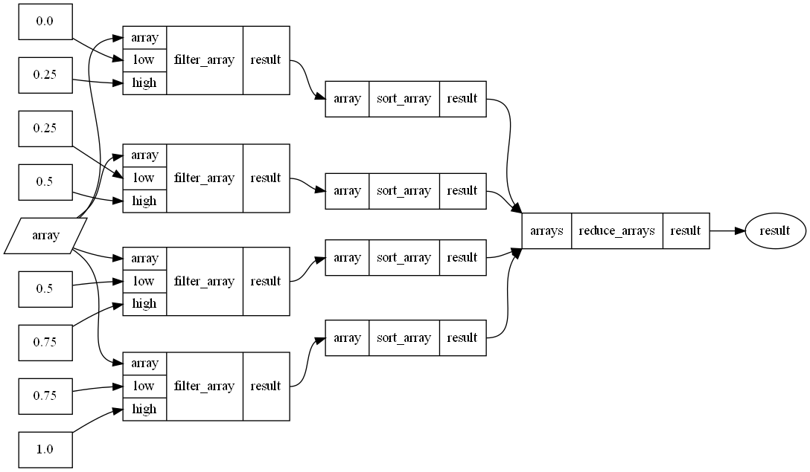

<div align="center">
  <a href="https://github.com/citi">
    
  </a>

  <h3 align="center">Citi/pargraph</h3>

  <p align="center">
    An efficient, light weight, and reliable distributed computation engine.
  </p>

  <p align="center">
    <a href="https://citi.github.io/pargraph/">
      
    </a>
    <a href="./LICENSE">
        
    </a>
    <a href="https://pypi.org/project/pargraph/">
      
    </a>
    
  </p>
</div>

<br />

**Pargraph is a light weight parallel graph computation library for Python**.

Pargraph consists of two modules: a graph creation tool and an embedded graph scheduler. You can use either or both modules in your code.

## Installation

### Install Pargraph via pip

```bash
pip install pargraph
```

If you want to use GraphBLAS for better graph scheduling performance, you may install the optional `graphblas` extra:

```bash
pip install pargraph[graphblas]
```

## Graph creation

Pargraph provides a simple graph creation tool that allows you to build task graphs by decorating ordinary Python functions.

Pargraph has two decorators:

- `@delayed`: Decorate a function to make it delayed. Delayed functions are pure, inseperable functions that form the nodes of the computation graph and can be computed in parallel.
- `@graph`: Make a function in to a graph. These functions may call `@delayed` or other `@graph` functions.

### Example

```python
import numpy as np
from pargraph import graph, delayed


@delayed
def filter_array(array: np.ndarray, low: float, high: float) -> np.ndarray:
    return array[(array >= low) & (array <= high)]


@delayed
def sort_array(array: np.ndarray) -> np.ndarray:
    return np.sort(array)


@delayed
def reduce_arrays(*arrays: np.ndarray) -> np.ndarray:
    return np.concatenate(arrays)


@graph
def map_reduce_sort(array: np.ndarray, partition_count: int) -> np.ndarray:
    return reduce_arrays(
        *(
            sort_array(filter_array(array, i / partition_count, (i + 1) / partition_count))
            for i in range(partition_count)
        )
    )
```

The `map_reduce_sort()` function behaves like a normal Python function if called with concrete arguments.

```python
import numpy as np

map_reduce_sort(np.random.rand(20))

# [0.06253707 0.06795382 0.11492823 0.14512393 0.20183152 0.41109117
#  0.42613798 0.45156214 0.4714821  0.54000373 0.54902451 0.62671881
#  0.64402013 0.65147012 0.70903525 0.77846584 0.83861765 0.89170381
#  0.92492478 0.95370363]
```

But it can also be turned in to a graph using the `to_graph()` method. Here, we also use `.to_dot()` to generate a visual representation of the graph, and then `.write_png()` to save it to a file. When we call `.to_graph()` we can fix some of the arguments to the function, here we fix the partition count.

```python
map_reduce_sort.to_graph(partition_count=4).to_dot().write_png("map_reduce_sort.png")
```



Moreover, you can compose graph functions with other graph functions to generate ever more complex graphs. In this case we have a recursive graph function.

```python
@graph
def map_reduce_sort_recursive(
    array: np.ndarray, partition_counts: List[int], _low: float = 0, _high: float = 1
) -> np.ndarray:
    if len(partition_counts) == 0:
        return sort_array(array)

    partition_count, *partition_counts = partition_counts

    sorted_partitions = []
    for i in range(partition_count):
        low = _low + (_high - _low) * (i / partition_count)
        high = _low + (_high - _low) * ((i + 1) / partition_count)
        sorted_partitions.append(map_reduce_sort_recursive(filter_array(array, low, high), partition_counts, low, high))

    return reduce_arrays(*sorted_partitions)
```

```python
map_reduce_sort_recursive.to_graph(partition_counts=4).to_dot().write_png("map_reduce_sort_recursive.png")
```


// ?
Use the `to_dict` method to convert the generated graph to a dict graph.

```python
import numpy as np
from distributed import Client

with Client() as client:
    client.get(map_reduce_sort.to_graph(partition_count=4).to_dict(array=np.random.rand(20)))[0]

# [0.06253707 0.06795382 0.11492823 0.14512393 0.20183152 0.41109117
#  0.42613798 0.45156214 0.4714821  0.54000373 0.54902451 0.62671881
#  0.64402013 0.65147012 0.70903525 0.77846584 0.83861765 0.89170381
#  0.92492478 0.95370363]
```

## Graph scheduler

Pargraph can parallelize graph execution on computation backends that may not support it natively.
Pargraph can function as a scheduler that orchestrates execution of a graph by submitting individual tasks to any given parallel backend.

Pargraph implements Dask's `get` API and supports the same task graph format used by Dask, making it a drop-in Dask replacement for applications that don't need a fully-fledged graph scheduler.

If installed, graph scheduling is powered by [GraphBLAS](https://graphblas.org), a high-performance sparse matrix linear
algebra library. It allows better scheduling performance for large and complex graphs (e.g. graphs with 100k+ nodes)
compared to native Python implementations.

## Usage

### Initialize graph engine

```python
from pargraph import GraphEngine

graph_engine = GraphEngine()
```

### Choose a parallel backend

If you want to use a parallel backend other than the default local multiprocessing backend, you may initialize a
different parallel backend and pass it into `GraphEngine`'s constructor.

#### Example with a dask backend

```python
from distributed import Client
from distributed.cfexecutor import ClientExecutor

dask_client = Client(...)
graph_engine = GraphEngine(ClientExecutor(dask_client))
```

You may also implement your own parallel backend by implementing the `submit` method.

#### Example with a custom backend

```python
from concurrent.futures import Future


class CustomBackend:
    def __init__(self):
        pass

    def submit(self, fn, /, *args, **kwargs) -> Future:
        future = Future()
        future.set_result(fn(*args, **kwargs))
        return future


backend = CustomBackend()
graph_engine = GraphEngine(backend)
```

### Compute graph

Build the task graph and compute a key of your choice:

```python
def inc(i):
    return i + 1


def add(a, b):
    return a + b


graph = {
    "x": 1,
    "y": (inc, "x"),
    "z": (add, "y", 10)
}
graph_engine.get(graph, "z")  # 12
```

You may also compute multiple keys if you like:

```python
graph_engine.get(graph, ["x", "y", "z"])  # [1, 2, 10]
```

## Contributing

Your contributions are at the core of making this a true open source project. Any contributions you make are **greatly appreciated**.

We welcome you to:

- Fix typos or touch up documentation
- Share your opinions on [existing issues](https://github.com/citi/pargraph/issues)
- Help expand and improve our library by [opening a new issue](https://github.com/citi/pargraph/issues/new)

Please review our [community contribution guidelines](https://github.com/Citi/.github/blob/main/CONTRIBUTING.md) and
[functional contribution guidelines](./CONTRIBUTING.md) to get started 👍.

## Code of Conduct

We are committed to making open source an enjoyable and respectful experience for our community. See
[`CODE_OF_CONDUCT`](https://github.com/Citi/.github/blob/main/CODE_OF_CONDUCT.md) for more information.

## License

This project is distributed under the [Apache-2.0 License](https://www.apache.org/licenses/LICENSE-2.0). See
[`LICENSE`](./LICENSE) for more information.

## Contact

If you have a query or require support with this project, [raise an issue](https://github.com/Citi/pargraph/issues). Otherwise, reach out to [opensource@citi.com](mailto:opensource@citi.com).
